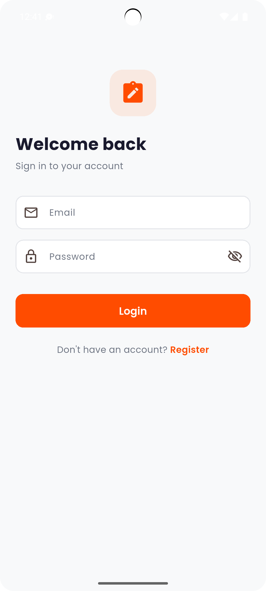
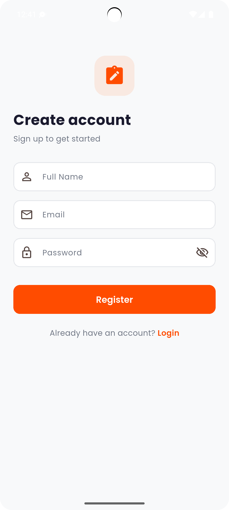
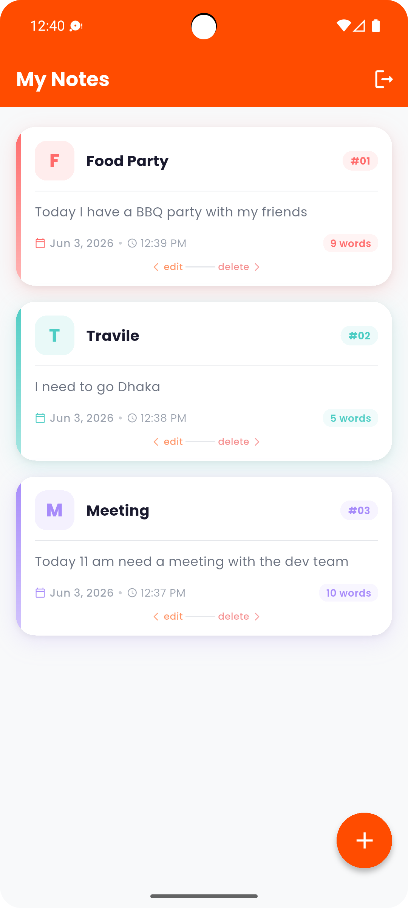
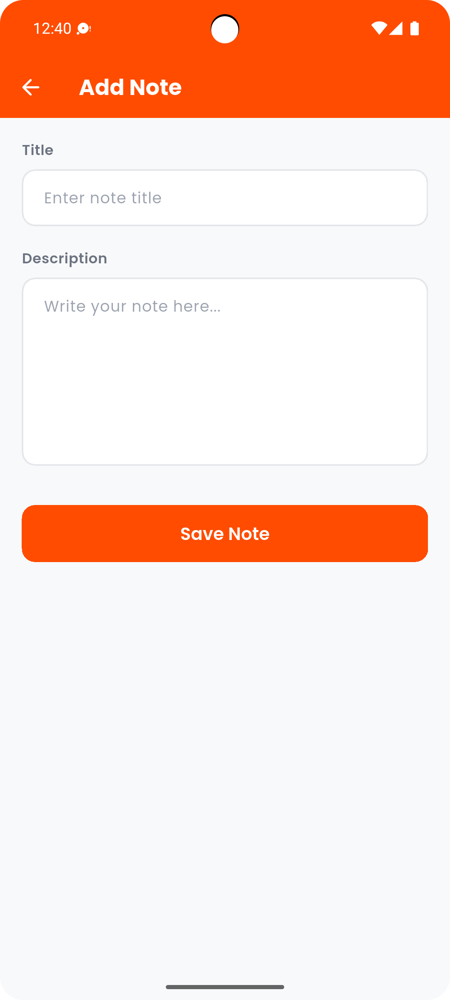

<div align="center">

# 📝 CareTutors Notes App

**A beautifully designed personal notes manager built with Flutter & Firebase.**

[](https://flutter.dev)
[](https://dart.dev)
[](https://firebase.google.com)
[](https://riverpod.dev)
[](LICENSE)
[](https://flutter.dev)

Register, log in, and manage your private notes — synced in real time with Cloud Firestore.

[View Demo](#test-account) · [Report Bug](https://github.com/mrswapon/CareTutors-Notes-App/issues) · [Request Feature](https://github.com/mrswapon/CareTutors-Notes-App/issues)

</div>

---

## Table of Contents

- [Screenshots](#screenshots)
- [Features](#features)
- [Tech Stack](#tech-stack)
- [Getting Started](#getting-started)
- [Test Account](#test-account)
- [Project Architecture](#project-architecture)
- [State Management](#state-management)
- [Navigation Routes](#navigation-routes)
- [Firestore Data Model](#firestore-data-model)
- [Dependencies](#dependencies)
- [Contributing](#contributing)
- [License](#license)
- [Author](#author)

---

## Screenshots

<table>
  <tr>
    <td align="center"><b>🔐 Login</b></td>
    <td align="center"><b>📋 Register</b></td>
    <td align="center"><b>🏠 Home — Notes List</b></td>
    <td align="center"><b>✏️ Add Note</b></td>
  </tr>
  <tr>
    <td></td>
    <td></td>
    <td></td>
    <td></td>
  </tr>
</table>

---

## Features

| # | Feature | Description |
|---|---|---|
| 🎬 | **Splash Screen** | Animated fade & scale entry screen on first launch |
| 🔐 | **Authentication** | Email & password sign-up and login via Firebase Auth |
| 📋 | **My Notes** | Real-time list of all personal notes, newest first |
| ➕ | **Add Note** | Create notes with a title and multiline description |
| ✏️ | **Edit Note** | Swipe a card **right** to open it in edit mode |
| 🗑️ | **Delete Note** | Swipe a card **left** to delete with a confirmation dialog |
| 🎨 | **Beautiful Cards** | Colour-coded cards with letter avatar, word count & date/time |
| 🔄 | **Auto-redirect** | Logged-in users go straight to Home; guests are blocked from protected routes |
| 💾 | **Persistent Session** | Firebase Auth keeps the user signed in across app restarts |

---

## Tech Stack

| Layer | Technology |
|---|---|
| **Framework** | Flutter 3.x |
| **Language** | Dart 3.x |
| **State Management** | Riverpod (`hooks_riverpod` + `flutter_hooks`) |
| **Navigation** | GoRouter |
| **Backend** | Firebase Authentication + Cloud Firestore |
| **Local Storage** | SharedPreferences |
| **Fonts** | Google Fonts — Poppins |
| **Date Formatting** | intl |

---

## Getting Started

### Prerequisites

Make sure you have the following installed:

- [Flutter SDK](https://docs.flutter.dev/get-started/install) `>=3.0.0`
- [Dart SDK](https://dart.dev/get-dart) `>=3.0.0`
- A [Firebase project](https://console.firebase.google.com/) with **Email/Password** auth and **Cloud Firestore** enabled
- [Firebase CLI](https://firebase.google.com/docs/cli)
- [FlutterFire CLI](https://firebase.flutter.dev/docs/cli)

### Installation

**1. Clone the repository**

```bash
git clone https://github.com/mrswapon/CareTutors-Notes-App.git
cd CareTutors-Notes-App
```

**2. Install dependencies**

```bash
flutter pub get
```

**3. Connect to Firebase**

> Skip this step if `firebase_options.dart` already contains real credentials.

```bash
dart pub global activate flutterfire_cli
flutterfire configure
```

This auto-generates `lib/firebase_options.dart` with your project's credentials.

**4. Set Firestore security rules**

In Firebase Console → **Firestore Database → Rules**, paste:

```js
rules_version = '2';
service cloud.firestore {
  match /databases/{database}/documents {

    match /users/{uid} {
      allow read, write: if request.auth.uid == uid;
    }

    match /notes/{noteId} {
      allow read, update, delete: if request.auth.uid == resource.data.userId;
      allow create: if request.auth != null;
    }
  }
}
```

**5. Run the app**

```bash
flutter run
```

---

## Test Account

Want to explore the app without registering? Use the pre-seeded demo account:

| | Credential |
|---|---|
| 📧 **Email** | `ujarsip@gmail.com` |
| 🔑 **Password** | `1qazxsw2` |

> ⚠️ This is a shared demo account. Please do not change the password or delete existing notes.

---

## Project Architecture

Clean Architecture with a feature-first folder structure:

```
lib/
├── core/
│   ├── constants/
│   │   ├── app_colors.dart        # Brand palette — primary: #FF4C00
│   │   └── app_strings.dart       # All UI text strings
│   ├── router/
│   │   └── app_router.dart        # GoRouter with auth-aware redirect
│   └── theme/
│       └── app_theme.dart         # Material 3 theme — Poppins, rounded UI
│
├── features/
│   ├── auth/
│   │   ├── data/
│   │   │   └── auth_repository.dart      # Firebase Auth + Firestore user save
│   │   ├── domain/
│   │   │   └── auth_provider.dart        # Riverpod providers & AuthController
│   │   └── presentation/
│   │       ├── login_page.dart
│   │       └── register_page.dart
│   │
│   ├── notes/
│   │   ├── data/
│   │   │   └── notes_repository.dart     # Firestore CRUD + real-time stream
│   │   ├── domain/
│   │   │   ├── note_model.dart           # NoteModel with fromFirestore / toMap
│   │   │   └── notes_provider.dart       # Riverpod providers & NotesController
│   │   └── presentation/
│   │       ├── home_page.dart
│   │       └── add_note_page.dart        # Handles both Add & Edit modes
│   │
│   └── splash/
│       └── presentation/
│           └── splash_page.dart
│
├── firebase_options.dart
└── main.dart
```

---

## State Management

All state is managed with **Riverpod** (`StateNotifierProvider` + `StreamProvider`):

| Provider | Type | Responsibility |
|---|---|---|
| `authRepositoryProvider` | `Provider` | Singleton `AuthRepository` instance |
| `authStateProvider` | `StreamProvider<User?>` | Watches Firebase auth state — `null` = signed out |
| `authControllerProvider` | `StateNotifierProvider` | Handles `signIn`, `register`, `signOut` with loading & error state |
| `notesRepositoryProvider` | `Provider` | Singleton `NotesRepository` instance |
| `notesProvider` | `StreamProvider<List<NoteModel>>` | Real-time Firestore stream for the current user's notes |
| `notesControllerProvider` | `StateNotifierProvider` | Handles `addNote`, `updateNote`, `deleteNote` with loading & error state |

---

## Navigation Routes

Routing is handled by **GoRouter** with auth-aware redirect logic:

| Route | Page | Protected |
|---|---|---|
| `/splash` | `SplashPage` | ❌ |
| `/login` | `LoginPage` | ❌ |
| `/register` | `RegisterPage` | ❌ |
| `/home` | `HomePage` | ✅ Redirects to `/login` if signed out |
| `/add-note` | `AddNotePage` (Add & Edit) | ✅ Redirects to `/login` if signed out |

> Authenticated users are automatically redirected away from `/splash`, `/login`, and `/register` to `/home`.

---

## Firestore Data Model

**`users/{uid}`**
```json
{
  "name":      "string",
  "email":     "string",
  "createdAt": "timestamp"
}
```

**`notes/{noteId}`**
```json
{
  "title":       "string",
  "description": "string",
  "userId":      "string",
  "createdAt":   "timestamp"
}
```

---

## Dependencies

```yaml
# Firebase
firebase_core: ^3.3.0
firebase_auth: ^5.1.4
cloud_firestore: ^5.2.1

# State Management
flutter_riverpod: ^2.5.1
hooks_riverpod: ^2.5.1
flutter_hooks: ^0.20.5

# Navigation
go_router: ^14.2.7

# Storage
shared_preferences: ^2.3.1

# UI & Utilities
google_fonts: ^6.2.1
intl: ^0.19.0
```

---

## Contributing

Contributions are welcome! Here's how:

1. **Fork** the repository
2. **Create** a feature branch
   ```bash
   git checkout -b feat/your-feature-name
   ```
3. **Commit** using [Conventional Commits](https://www.conventionalcommits.org/)
   ```bash
   git commit -m "feat: add dark mode support"
   ```
4. **Push** to your branch
   ```bash
   git push origin feat/your-feature-name
   ```
5. **Open** a Pull Request

---

## Author

<div align="center">

**Mr. Swapon**

[](https://github.com/mrswapon)

*Made with ❤️ using Flutter & Firebase*

</div>
